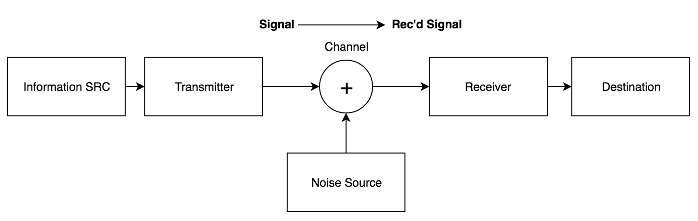

```{python, echo = FALSE}
import numpy as np
import matplotlib.pyplot as plt


```

# Introduction

Often, lecture notes like these jump into the material without establishing the basics. This chapter will cover why this book exists and how to use it.

## Philosophy

Two other sets of notes for this course are available at https://github.com/mananshah99/infotheory and http://tiny.cc/infotheory1 . My goal in preparing _this_ book was simply to ensure that I understand the concepts. As a result, I've spared no expense in filling these notes with as much content as needed to develop the theory from first principles. 

It's also worth noting that the stylistic choices I've made here are very opinionated. The margins are very wide and are filled with important asides and footnotes. This format is a result of choosing to use Edward Tufte's style. Additionally, I've tried to stick to the typical definition-theorem-proof style with explanatory prose in between.

Making this book has been a labor of love, requiring more time than I care to admit. Hopefully, it is a useful resource for you.

## Prerequisites

This book really only assumes a working proficiency with single-variable calculus (which even then is mostly for intuition) and some familiarity with multivariable calculus. Important concepts of probability are developed from scratch, however. Intuition is heavily emphasized.

## Why study Information Theory?

Information Theory is a mathematical framework for thinking about what it means to have efficient communication. Examples of information include:

- Email
- Telegraph
- Images
- Speech
- Video

Much of today's digital world revolves around transmitting information: we zip files, email them across the internet, download MP3s, etc. The ideas of information theory give us a rigorous way of characterizing streams of information. The cornerstone of our model will start with the following pipeline of sorts



This model gives us a general way of abstracting the transmission of information. On the left we have a source of information (where a signal originates) that is sent to a transmitter. A channel then allows that signal to flow to a receiver, although noise may be added at this stage. Finally, the receiver sends the signal to the destination. Right now, this model may not be very elucidating. However, we will see that it gives us a structure within which we can consider various mathematical characterizations of information. However, before we can begin to consider information in depth, we must first start our foundation with a solid understanding of probability as that is the underlying theory below Information Theory.